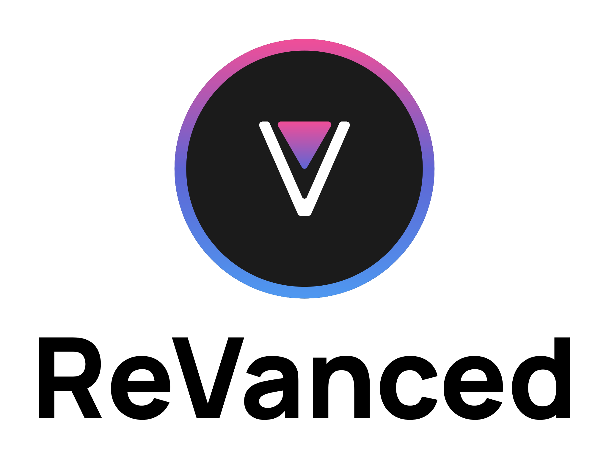

<p align="center">
  <picture>
    <source
      width="256px"
      media="(prefers-color-scheme: dark)"
      srcset="assets/revanced-headline/revanced-headline-vertical-dark.svg"
    >
    
  </picture>
  <br>
  <a href="https://revanced.app/">
     <picture>
         <source height="24px" media="(prefers-color-scheme: dark)" srcset="assets/revanced-logo/revanced-logo.svg" />
         
     </picture>
   </a>&nbsp;&nbsp;&nbsp;
   <a href="https://github.com/ReVanced">
       <picture>
           <source height="24px" media="(prefers-color-scheme: dark)" srcset="https://i.ibb.co/dMMmCrW/Git-Hub-Mark.png" />
           
       </picture>
   </a>&nbsp;&nbsp;&nbsp;
   <a href="http://revanced.app/discord">
       <picture>
           <source height="24px" media="(prefers-color-scheme: dark)" srcset="https://user-images.githubusercontent.com/13122796/178032563-d4e084b7-244e-4358-af50-26bde6dd4996.png" />
           
       </picture>
   </a>&nbsp;&nbsp;&nbsp;
   <a href="https://reddit.com/r/revancedapp">
       <picture>
           <source height="24px" media="(prefers-color-scheme: dark)" srcset="https://user-images.githubusercontent.com/13122796/178032351-9d9d5619-8ef7-470a-9eec-2744ece54553.png" />
           
       </picture>
   </a>&nbsp;&nbsp;&nbsp;
   <a href="https://t.me/app_revanced">
      <picture>
         <source height="24px" media="(prefers-color-scheme: dark)" srcset="https://user-images.githubusercontent.com/13122796/178032213-faf25ab8-0bc3-4a94-a730-b524c96df124.png" />
         
      </picture>
   </a>&nbsp;&nbsp;&nbsp;
   <a href="https://x.com/revancedapp">
      <picture>
         <source media="(prefers-color-scheme: dark)" srcset="https://user-images.githubusercontent.com/93124920/270180600-7c1b38bf-889b-4d68-bd5e-b9d86f91421a.png">
         
      </picture>
   </a>&nbsp;&nbsp;&nbsp;
   <a href="https://www.youtube.com/@ReVanced">
      <picture>
         <source height="24px" media="(prefers-color-scheme: dark)" srcset="https://user-images.githubusercontent.com/13122796/178032714-c51c7492-0666-44ac-99c2-f003a695ab50.png" />
         
     </picture>
   </a>
   <br>
   <br>
   Continuing the legacy of Vanced
</p>

# 🔍 ReVanced Manager APK Sources Downloader


A ReVanced Manager downloader plugin that fetches APKs from APKMirror, APKPure, and APKCombo.

## ❓ About

This is a ReVanced Manager downloader plugin that allows users to download APKs from multiple popular sources:

- APKMirror
- APKPure
- APKCombo

The plugin automatically tries each source in order until it finds a matching APK for the requested package name and version.

## 🚀 Features

- **Multi-source support**: Fetches APKs from APKMirror, APKPure, and APKCombo
- **Automatic fallback**: If one source fails, the plugin automatically tries the next source
- **Version selection**: Supports downloading specific versions or the latest version
- **Error handling**: Gracefully handles errors with appropriate error messages
- **APK verification**: Verifies APK integrity after download
- **Modular architecture**: Easy to add new sources in the future

## 🧩 Implementation Details

### Sources

1. **APKMirror**
   - Searches for apps by package name
   - Navigates through search results to find the correct app
   - Handles version selection and download
   - Bypasses anti-scraping measures

2. **APKPure**
   - Provides an alternative source for APKs
   - Supports version selection
   - Handles download initiation

3. **APKCombo**
   - Third fallback option for APK downloads
   - Supports searching and version selection
   - Handles download links extraction

### Technical Implementation

- Uses WebView for navigating through sources
- Implements Jsoup for HTML parsing
- Uses Retrofit/OkHttp for direct download links
- Implements coroutines for asynchronous operations
- Provides download progress tracking

[^1]: [Example README.md file](https://github.com/ReVanced/revanced-manager/blob/main/README.md)
[^2]: [Example issue templates](https://github.com/ReVanced/revanced-manager/tree/main/.github/ISSUE_TEMPLATE)
[^3]: [Example contribution guidelines](https://github.com/ReVanced/revanced-manager/blob/main/CONTRIBUTING.md)

## 🧑‍💻 Usage

### For Users

1. Install the APK Sources Downloader plugin in ReVanced Manager
2. When patching an app, select this plugin as the download source
3. The plugin will automatically search for the app across all sources
4. If a specific version is requested, the plugin will attempt to find that version
5. The download will begin automatically once the APK is found

### For Developers

To extend this plugin with new sources:

1. Implement the `APKSource` interface
2. Add your new source to the sources list in `APKSourcesDownloader.kt`
3. Ensure proper error handling and logging
4. Follow the existing pattern for WebView navigation and download handling

## 📚 Everything else

### 📙 Contributing

Thank you for considering contributing to ReVanced Manager downloader.  
You can find the contribution guidelines [here](CONTRIBUTING.md).

### 🛠️ Building

To build ReVanced Manager downloader template, a Java Development Kit (JDK) and Git must be installed.  
Follow the steps below to build ReVanced Manager downloader template:

1. Run `git clone git@github.com:ReVanced/revanced-manager-downloader-template.git` to clone the repository
2. Run `gradlew assembleRelease` to build the project

> [!NOTE]
> If the build fails due to authentication, you may need to authenticate to GitHub Packages.
> Create a PAT with the scope `read:packages` [here](https://github.com/settings/tokens/new?scopes=read:packages&description=ReVanced) and add your token to ~/.gradle/gradle.properties.
>
> Example `gradle.properties` file:
>
> ```properties
> gpr.user = user
> gpr.key = key
> ```

## 📜 License

ReVanced Manager APK Sources Downloader is licensed under the GPLv3 license.
Please see the [license file](LICENSE) for more information.
[tl;dr](https://www.tldrlegal.com/license/gnu-general-public-license-v3-gpl-3) you may copy, distribute
and modify ReVanced Manager APK Sources Downloader as long as you track changes/dates in source files.
Any modifications to ReVanced Manager APK Sources Downloader must also be made available under the GPL,
along with build & install instructions.
